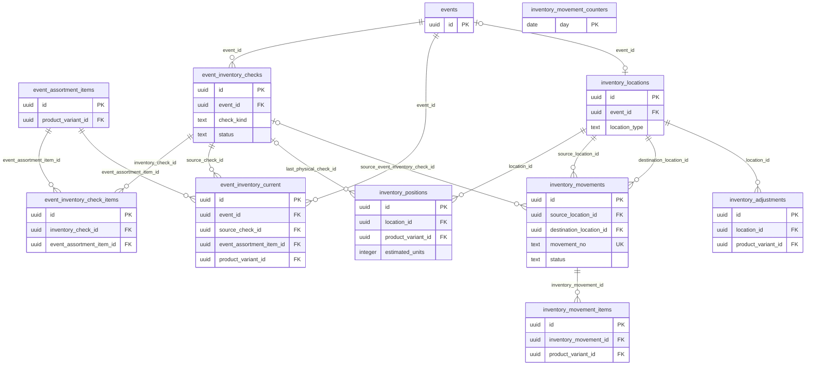

# ERD

Source: live PostgreSQL `public` schema after `npx supabase db reset`.  
Cross-check: `docs/SCHEMA_INVENTORY.md`, `scripts/schema-inventory.json`.

Public business tables: **43**. Public FKs: **101**. Enums: **7**.

`auth.users` is not a public table. It appears only in ERD-A as an external reference for `profiles.id`.

Cardinality follows actual FK nullability and UNIQUE constraints. No planned/future tables.

---

## ERD-A — AUTH / EVENT

```mermaid
erDiagram
  "auth.users" {
    uuid id PK
  }
  profiles {
    uuid id PK_FK
    text phone UK
    app_role role
    boolean is_master
  }
  invites {
    uuid id PK
    uuid profile_id FK
    text token_hash UK
  }
  events {
    uuid id PK
    uuid created_by FK
    uuid organizer_id FK
    event_status status
    event_contract_type contract_type
  }
  event_organizers {
    uuid id PK
    text name
    text calendar_color
  }
  event_organizer_terms {
    uuid organizer_id PK_FK
    event_contract_type default_contract_type
  }
  event_organizer_contacts {
    uuid id PK
    uuid organizer_id FK
    event_contact_type contact_type
  }
  event_members {
    uuid id PK
    uuid event_id FK
    uuid profile_id FK
    event_assignment_role assignment_role
  }
  event_contacts {
    uuid id PK
    uuid event_id FK
    event_contact_type contact_type
  }
  event_photos {
    uuid id PK
    uuid event_id FK
    text storage_path UK
  }

  "auth.users" ||--|| profiles : "profiles.id"
  profiles ||--o{ invites : profile_id
  profiles |o--o{ events : created_by
  event_organizers |o--o{ events : organizer_id
  event_organizers ||--|| event_organizer_terms : organizer_id
  event_organizers ||--o{ event_organizer_contacts : organizer_id
  events ||--o{ event_members : event_id
  profiles ||--o{ event_members : profile_id
  events ||--o{ event_contacts : event_id
  events ||--o{ event_photos : event_id
  profiles |o--o{ event_photos : uploaded_by
```

- `profiles.id` is both PK and FK to `auth.users(id)` ON DELETE CASCADE (identifying 1:1).
- `event_members` is the N:M assignment table; UNIQUE `(event_id, profile_id)`.
- `event_contacts.event_id` is NOT NULL, ON DELETE CASCADE.
- `events.organizer_id` is nullable (legacy events). New UI requires a selection.
- `event_organizer_terms` is 1:1 ADMIN-only default contract. Snapshot onto `events` at create.
- Organizer contacts are master rows; `event_contacts` remains the per-event snapshot.
- Partial UNIQUE on `invites(profile_id)` applies only while `used_at` and `revoked_at` are NULL.

---

## ERD-B — PREPARATION / PRODUCT / ASSORTMENT

```mermaid
erDiagram
  preparation_sets {
    uuid id PK
  }
  preparation_items {
    uuid id PK
    preparation_item_type item_type
  }
  preparation_set_items {
    uuid id PK
    uuid preparation_set_id FK
    uuid preparation_item_id FK
  }
  event_preparation_plans {
    uuid id PK
    uuid event_id FK_UK
    uuid source_preparation_set_id FK
  }
  event_preparation_items {
    uuid id PK
    uuid plan_id FK
    uuid event_id FK
    uuid source_preparation_item_id FK
  }
  product_categories {
    uuid id PK
    uuid parent_id FK
    text code UK
  }
  products {
    uuid id PK
    text product_code UK
    uuid primary_category_id FK
  }
  product_variants {
    uuid id PK
    uuid product_id FK
    text sku_code UK
  }
  sizes {
    uuid id PK
    text code UK
  }
  colors {
    uuid id PK
    text code UK
  }
  tags {
    uuid id PK
    text name UK
  }
  product_tags {
    uuid product_id PK_FK
    uuid tag_id PK_FK
  }
  attribute_definitions {
    uuid id PK
    text code UK
  }
  product_attribute_values {
    uuid id PK
    uuid product_id FK
    uuid attribute_definition_id FK
  }
  product_images {
    uuid id PK
    uuid product_id FK
    text storage_path UK
  }
  assortment_sets {
    uuid id PK
  }
  assortment_set_rules {
    uuid id PK
    uuid assortment_set_id FK
  }
  event_assortments {
    uuid id PK
    uuid event_id FK_UK
    uuid source_assortment_set_id FK
  }
  event_assortment_items {
    uuid id PK
    uuid event_assortment_id FK
    uuid product_variant_id FK
  }
  events {
    uuid id PK
  }

  preparation_sets ||--o{ preparation_set_items : preparation_set_id
  preparation_items ||--o{ preparation_set_items : preparation_item_id
  events ||--o| event_preparation_plans : event_id
  preparation_sets |o--o{ event_preparation_plans : source_preparation_set_id
  event_preparation_plans ||--o{ event_preparation_items : plan_id
  events ||--o{ event_preparation_items : event_id
  preparation_items |o--o{ event_preparation_items : source_preparation_item_id
  product_categories ||--o{ product_categories : parent_id
  product_categories ||--o{ products : primary_category_id
  products ||--o{ product_variants : product_id
  sizes ||--o{ product_variants : size_id
  colors ||--o{ product_variants : primary_color_id
  products ||--o{ product_tags : product_id
  tags ||--o{ product_tags : tag_id
  products ||--o{ product_attribute_values : product_id
  attribute_definitions ||--o{ product_attribute_values : attribute_definition_id
  products ||--o{ product_images : product_id
  assortment_sets ||--o{ assortment_set_rules : assortment_set_id
  events ||--o| event_assortments : event_id
  assortment_sets |o--o{ event_assortments : source_assortment_set_id
  event_assortments ||--o{ event_assortment_items : event_assortment_id
  product_variants ||--o{ event_assortment_items : product_variant_id
  assortment_set_rules |o--o{ event_assortment_items : source_rule_id
```

- Preparation **template** is `preparation_sets` + `preparation_set_items`. Apply copies into `event_preparation_plans` (UNIQUE `event_id`) and `event_preparation_items` snapshots. Changing the template does not rewrite existing event snapshot rows (no live FK update path from master name/qty into snapshot columns).
- Assortment **template** is `assortment_sets` + `assortment_set_rules`. Apply creates `event_assortments` (UNIQUE `event_id`) and `event_assortment_items`. `source_assortment_set_id` / `source_rule_id` are optional FKs; snapshot display columns are stored on the event rows.
- `product_tags` uses composite PK `(product_id, tag_id)`.
- `products.primary_category_id`, `product_variants.size_id`, and `product_variants.primary_color_id` are nullable FKs.

---

## ERD-C — INVENTORY



- `event_inventory_current` is the last **confirmed physical check** per event+SKU (`source_check_id` NOT NULL, UNIQUE `(event_id, product_variant_id)`). It does not apply later movements.
- `inventory_positions` is **operational projected stock** at a location (UNIQUE `(location_id, product_variant_id)`). Confirming a check, receiving a movement, or writing an adjustment updates this projection. History stays on checks, movements, and `inventory_adjustments`.
- EVENT location: CHECK requires `event_id`; unique index `(event_id) WHERE location_type = 'EVENT'`. HQ: unique index on `location_type` where HQ. Non-EVENT rows have `event_id` NULL.
- Movement source and destination are two required FKs to `inventory_locations`; CHECK `source_location_id <> destination_location_id`.
- `inventory_movement_counters` has PK `day` and no FKs. It is a numbering helper, not a stock entity.

---

## ERD-D — FINANCE / AUDIT

```mermaid
erDiagram
  events {
    uuid id PK
    event_contract_type contract_type
    numeric commission_rate
    numeric fixed_fee
  }
  event_daily_sales {
    uuid id PK
    uuid event_id FK
    date business_date
  }
  expense_categories {
    uuid id PK
    text code UK
  }
  event_expenses {
    uuid id PK
    uuid event_id FK
    uuid expense_category_id FK
    timestamptz voided_at
  }
  event_expense_receipts {
    uuid id PK
    uuid expense_id FK
    uuid event_id FK
    text storage_path UK
  }
  event_financial_inputs {
    uuid event_id PK_FK
    numeric estimated_product_cost
  }
  audit_logs {
    uuid id PK
    uuid event_id FK
    uuid actor_profile_id FK
    text entity_type
    text action
  }

  events ||--o{ event_daily_sales : event_id
  events ||--o{ event_expenses : event_id
  expense_categories ||--o{ event_expenses : expense_category_id
  event_expenses ||--o{ event_expense_receipts : expense_id
  events ||--o{ event_expense_receipts : event_id
  events ||--o| event_financial_inputs : event_id
  events |o--o{ audit_logs : event_id
```

- Daily sales are keyed UNIQUE `(event_id, business_date)`. There is **no FK** from sales to inventory tables, and Daily Sales is not auto-linked to inventory.
- `estimated_product_cost` is an **ADMIN manual input** on `event_financial_inputs` (PK = `event_id`). NULL vs 0 is preserved by CHECK (`NULL OR >= 0`).
- Contract commission/fixed fee columns are on `events`, not duplicated on finance tables. Financial Summary is computed from those source rows (sales, non-void expenses, financial inputs, contract fields).
- `event_expenses.voided_at` marks exclusion from P&L; void expenses are omitted from profit/loss.
- `audit_logs` records change history (CREATE/UPDATE/VOID). `event_id` is nullable; entity_type is constrained to DAILY_SALES, EXPENSE, PRODUCT_COST.
